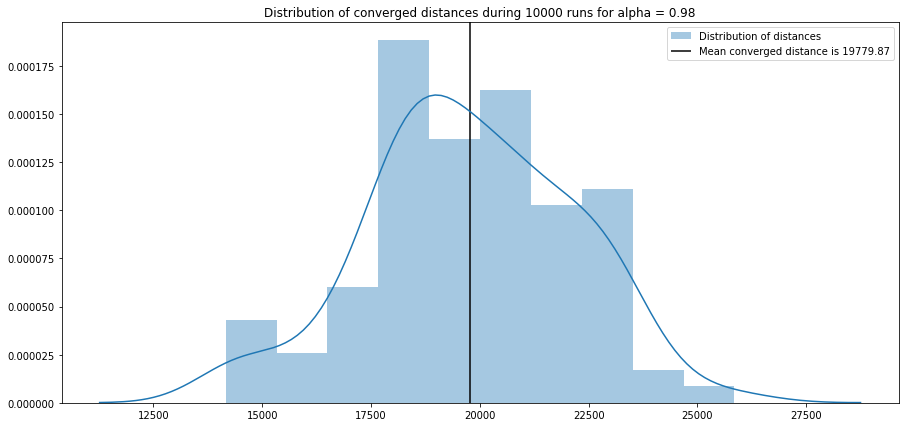

# Solving travelling salesman problem with simulated annealing

In this assignment I used simulated annealing to solve travelling salesman optimization problem. Each step of SA can be expressed in python code as:
```python
new_order = permute(order) # Get new path
thresh = np.random.uniform() # Sample from U(0,1)
new_distance = dist(new_order, xs, ys) # Compute path length
d = (new_distance - distance) / distance # Compute distance gain
p = 1 if d < 0 else np.exp( - d / T)  # If gain is positive, probability of choosing it is 1, else e^(-d/T)
if p >= thresh: # Compare probability with U(0,1)
    order = new_order # If it is larger, accept new path
    distance = new_distance
T = T * alpha  # Update temperature
```
For this task I used exponential update of T.
#### Visualization
Here is the example visualization for alpha = 0.98 and 2000 iterations.

#### Different alpha values
Following table contains distributions of distances which SA have converged to with different alpha values. As it can be seen from the plot, the values between 0.9 and 0.99 seems to be the most optimal. 
|  |  
| ------------ | ------------- 
|  |  |

Following table contains distributions of iterations which SA took to converg to with different alpha values. As it can be seen from the plot, the larger values of alpha need more iterations to converge.

|  |  
| ------------ | ------------- 
|  |  |